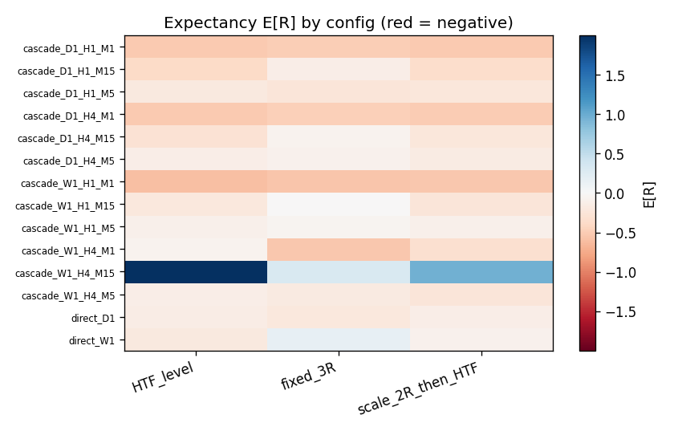

# Multi-Timeframe SMC Price-Action Strategy on XAUUSD — A Falsification Study

An institutional-grade, **falsification-oriented** backtest that asks one question honestly: does a
top-down, multi-timeframe **Smart-Money-Concepts (SMC)** price-action strategy carry a *statistically
real* edge on gold (XAUUSD)? It pairs a paranoid, zero-look-ahead event-driven engine with the full
inference toolbox — Monte-Carlo, a two-null random-entry benchmark, Benjamini–Hochberg FDR + Deflated
Sharpe, walk-forward, regime analysis, and a once-only locked out-of-sample test — and the discipline
to trust a negative result.

`Python` · `pandas/numpy/scipy` · event-driven backtester · intrabar M1 fills · 42-config grid ·
two-null random-entry · BH-FDR/DSR/PSR · 90 unit tests

## The honest finding
**No confirmable edge.** Across **42 pre-registered configurations** on IS 2015–2022, with realistic
costs and proven no-look-ahead:

- **0 / 42 survive Benjamini–Hochberg FDR**; **every expectancy CI crosses zero**; **max Deflated
  Sharpe = 0.00**.
- The only positive point estimates have **N < 30** (small-sample noise); the high-N deep cascades are
  firmly negative (E[R] ≈ −0.5, costs + ~18% win rate on 3R targets).
- The **single pre-registered out-of-sample** evaluation (finalist `cascade_W1_H1_M5_fixed_3R`, chosen
  before unsealing 2023–2025) returns a *tempting* **+0.62R, PF 2.0, Sharpe 1.68** — on **7 trades**,
  with a CI of **[−0.54, +2.32]** and **p = 0.124**. A single noisy point, **not** an edge. The
  no-edge conclusion stands.

> A "+0.62R, PF 2.0, it works out-of-sample!" headline is exactly what this study is built to *not*
> fall for. Surfacing why it's noise — the same null that two prior independent studies reached — is
> the point.



## What's on display (engineering)
- **Proven** zero look-ahead — truncation-invariance tests on every detector + an end-to-end engine
  test (deleting the future cannot change a resolved trade). MTF data is right-aligned to the NY-close
  (DST-aware) for gold.
- **Intrabar M1 fill resolution** with a documented worst-case same-bar SL/TP tie-break; full
  transaction costs **attributed and charged exactly once per fill** (cross-checked by an independent
  fill-based recompute).
- **Falsification statistics**: a **two-null random-entry** benchmark (unconstrained vs bias-matched)
  that decomposes "trend filter" from "SMC structure"; Monte-Carlo that reveals a near-flat config
  hides a **100% risk of ruin** (4%-win-rate fat tail); BH-FDR + DSR/PSR over the trial count.
- **Reproducible & fast**: fixed seeds, config snapshots, a resumable/observable grid runner, and
  bit-identical performance optimizations (verified by MD5 / `<1e-9`, e.g. an O(n²) POI hotspot fixed
  315s → <1s).

## Read more
- **[`docs/REPORT.md`](docs/REPORT.md)** — the full academic write-up (data, methodology, results,
  limitations, conclusion).
- [`docs/SPEC.md`](docs/SPEC.md) — every definition, decision, and the parameter grid.
- [`docs/DATA_QUALITY.md`](docs/DATA_QUALITY.md) — gaps, integrity, per-year/timeframe counts.

## Reproduce
```powershell
python -m venv .venv
.venv\Scripts\python -m pip install -r requirements.txt
.venv\Scripts\python -m pytest -q                       # 90 tests
.venv\Scripts\python scripts\run_grid.py fresh          # 42-config IS grid (~30 min, pollable)
.venv\Scripts\python scripts\run_robustness.py 1000      # robustness on survivors
.venv\Scripts\python scripts\run_oos.py                 # locked OOS one-shot
```
Data is **not committed** (size + HistData licence). See [`docs/SPEC.md`](docs/SPEC.md) §1.5 for
acquisition; a tiny synthetic sample drives the no-download tests.

## This is part of a research arc
| | Paradigm | Verdict tool | Result |
|---|---|---|---|
| V1 | Subjective SMC price-action | Walk-forward OOS | No robust edge |
| V2 | Objective Donchian breakout | Monte-Carlo + experiments | No confirmable edge |
| **This project (single-instrument)** | **Structured MTF-SMC grid** | **BH-FDR/DSR + random-entry + locked OOS** | **No confirmable edge** |

Three paradigms, three lenses, the same conclusion: **single-instrument trend/structure alpha on gold
is too thin to confirm** — which is *why* professional trend-following is multi-asset and diversified.
Pursuing that multi-instrument replication — does any config's edge survive across independent
instruments after correction? — is the current direction of this project.

## Limitations & disclaimer
Single instrument; modelled (not historical) spread/slippage; SMC discretion operationalized into one
specific rule-set; deep cascades are trade-starved by construction. **Research and educational only —
not investment advice.** The strategy was found to have no confirmable edge and must not be traded.

## License
MIT (see [`LICENSE`](LICENSE)).
