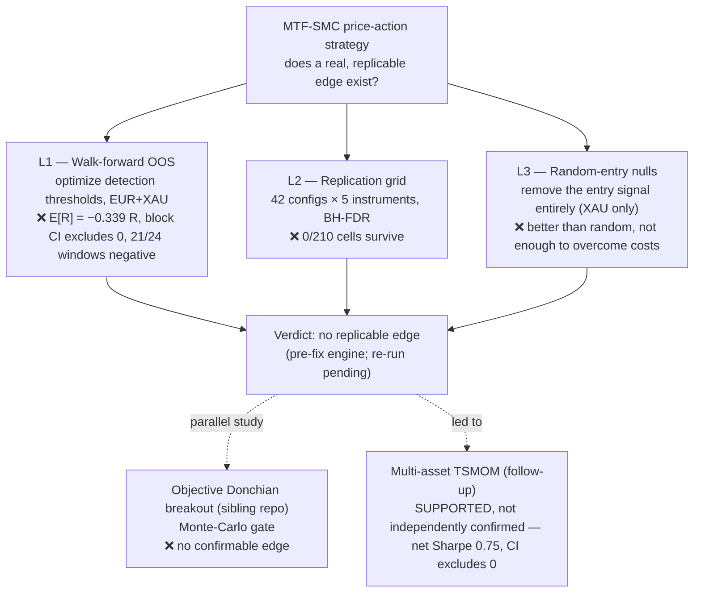
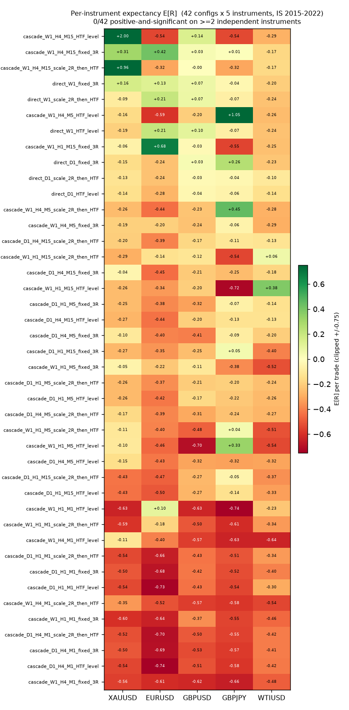

# Multi-Timeframe SMC Price-Action — A Multi-Instrument Falsification Study

[](https://github.com/AaroNLaU0307/quant-backtest-framework/actions/workflows/tests.yml)

An institutional-grade, **falsification-oriented** backtest asking one question honestly: does a
top-down, multi-timeframe **Smart-Money-Concepts (SMC)** price-action strategy carry a *statistically
real* edge that **replicates across independent instruments**? It pairs an event-driven engine with
intrabar M1 fills and truncation-tested detection with the full inference toolbox — per-instrument cost
calibration, Benjamini–Hochberg FDR + Deflated Sharpe, cross-instrument correlation + correlation-aware
random-effects meta-analysis, and a once-only locked out-of-sample gate — and the discipline to trust a
negative result.

> **Correction (2026-09-27).** Two look-ahead paths in the engine were fixed after every number on this
> page was produced: take-profit targets used swing points before they were confirmed, and a limit order
> that had already filled could be cancelled by the close of its own fill bar (a stop inside the fill
> bar is now also honoured). Every result below — the grid, the 0/210 replication, the walk-forward
> (−0.339 R, 21/24), the eye-catching cells and the random-entry comparison — comes from the pre-fix
> engine and is **pending a re-run** with the licensed data. The verdict, FALSIFIED (no replicable
> edge), is the one produced on the pre-fix engine. What changed and the exact re-run:
> [`docs/ADDENDUM_2026-09-27.md`](docs/ADDENDUM_2026-09-27.md) · [`RERUN_RUNBOOK.md`](RERUN_RUNBOOK.md).

`Python 3.13` · `pandas/numpy/scipy` · event-driven backtester · intrabar M1 fills · **5 instruments × 42
configs = 210 trials** · BH-FDR/DSR · correlation-aware meta-analysis · **170 tests (161 run in CI; 9 need
the licensed data)**

## TL;DR (60 seconds)
- **The finding: no replicable edge** (pre-fix engine; re-run pending). 42 pre-registered configs ×
  5 instruments (XAUUSD, EURUSD, GBPUSD, GBPJPY, WTIUSD), IS 2015–2022: **0/210** config×instrument
  cells survive cross-instrument BH-FDR; best correlation-aware pooled expectancy **−0.000 R**.
- **Three complementary tests on one engine** — a detection-threshold **walk-forward** (**E[R] =
  −0.339 R**, window-block 95% CI **[−0.436, −0.223]**, 21/24 windows negative), the
  **multi-instrument replication grid** above, and a **random-entry null** (XAUUSD only: better than
  random entries, but not enough to overcome costs) — none shows an edge that survives costs.
- **The eye-catching cells don't survive scrutiny** — +2.0 R on gold is positive on only 2 of 5
  instruments (the second, GBPUSD, a marginal +0.14); +1.0 R on GBPJPY is positive on only itself.
  Neither was significant on any instrument. Both are `HTF_level` configurations, the path the
  take-profit fix changes.
- **Five instruments are never treated as five independent votes** — a cross-instrument correlation
  matrix deflates them to an **effective 3.45**, inflating pooled variance ×1.45 before any significance
  claim.
- **A real bug was caught by watching the output, not by a passing test** — a gold-calibrated constant
  produced an impossible −25 R on EURUSD; the fix was locked behind a systematic absolute-price-constant
  audit of the whole signal/fill/cost path and checked with a synthetic −1R stop-out on each of the five
  instruments.
- **170 tests**; CI runs the 161 that need no licensed data on every push (badge above). The other 9,
  including a real-data end-to-end check, need the HistData cache.

## The arc at a glance


```mermaid
flowchart TD
    Q["MTF-SMC price-action strategy<br/>does a real, replicable edge exist?"]

    Q --> L1["L1 — Walk-forward OOS<br/>optimize detection thresholds, EUR+XAU<br/>❌ E[R] = −0.339 R, block CI excludes 0, 21/24 windows negative"]
    Q --> L2["L2 — Replication grid<br/>42 configs × 5 instruments, BH-FDR<br/>❌ 0/210 cells survive"]
    Q --> L3["L3 — Random-entry nulls<br/>remove the entry signal entirely (XAU only)<br/>❌ better than random, not enough to overcome costs"]

    L1 --> V["Verdict: no replicable edge<br/>(pre-fix engine; re-run pending)"]
    L2 --> V
    L3 --> V

    V -. parallel study .-> SIB["Objective Donchian breakout (sibling repo)<br/>Monte-Carlo gate<br/>❌ no confirmable edge"]
    V -. led to .-> FU["Multi-asset TSMOM (follow-up)<br/>SUPPORTED, not independently confirmed — net Sharpe 0.75, CI excludes 0"]
```

## The honest finding
**No replicable edge.** Across **42 pre-registered configurations** on five instruments (XAUUSD, EURUSD,
GBPUSD, GBPJPY, WTIUSD), IS 2015–2022, with realistic per-instrument costs (pre-fix engine; see the
correction above):

- **0 / 42** configurations survive Benjamini–Hochberg FDR on **any** instrument; **0 / 42** are
  positive-and-significant on even one instrument, **0 / 42** on two or more.
- **0 / 210** (config × instrument) cells survive the cross-instrument BH-FDR.
- The best **correlation-aware** random-effects pooled expectancy is **−0.000 R** (one-sided p ≥ 0.50).
- The eye-catching cells don't generalize — **+2.0 R on gold** is positive on only 2 of 5 instruments
  (the second, GBPUSD, a marginal +0.14) and negative on the rest; **+1.0 R on GBPJPY** is positive on
  only itself (1 of 5). Neither was significant on any instrument.

By the pre-registered rule, nothing earned an out-of-sample look, so **the locked OOS stays sealed.**



> A "+2 R on gold, it works!" headline is exactly what this study is built to *not* fall for. A negative
> that **replicates as a non-result across FX majors, an FX cross, a metal, and crude — after correction**
> is a *stronger, more credible* falsification than any single-instrument result.

## Three lenses, one verdict
This repo unifies a previously separate single-instrument **walk-forward** study onto the same engine,
so the strategy is tested three complementary ways. They share the engine and the IS period (and L1/L3
share instruments), so an engine flaw reaches all three — which is why all three are being re-run.

- **Walk-forward OOS** — optimize the legacy detection thresholds on a fixed D1→H1→M5, roll IS18/OOS6:
  pooled **E[R] = −0.339 R**, window-block bootstrap 95% CI **[−0.436, −0.223]**, **21/24 windows
  negative**. The 24 windows are 12 calendar periods shared by XAUUSD and EURUSD, so the sign test now
  runs on the 12 periods (result pending the re-run). This reproduces the old published strategy's
  **−0.27 R** on the unified engine (on the sealed-wall IS span 2015–2022; the old rolled into 2023).
- **Replication grid** (this study) — **0 / 210** config×instrument cells survive cross-instrument BH-FDR.
- **Random-entry nulls** — on XAUUSD, the only instrument this lens was run on, the structured entries
  beat both random-entry nulls (e.g. +0.142 R and +0.354 R per trade over the bias-matched null for the
  two configurations reported): better than random entries, but not enough to overcome costs — the
  strategy stays net-negative. The gap is an upper bound (the holding-time match is imperfect);
  [`docs/REPORT.md`](docs/REPORT.md) §6.

The full three-lens write-up — including the behavioural **fidelity** check that the reproduced strategy
*is* the old one (86 % entry overlap, matched-pair R 16/18) — is in
**[`docs/MERGE_REPORT.md`](docs/MERGE_REPORT.md)**.

## What's on display (engineering & rigor)
- **Look-ahead tests** — truncation-invariance tests for ATR, EMA, swings, FVG and structure; for every
  `TFView` as-of lookup (the take-profit target on ordinary and major swings, HTF bias, POI,
  structure-with-FVG) at many cut points; constructed M1 paths for the order-fill rules; and an
  end-to-end prefix-invariance test (both entry models, the legacy model, every take-profit mode) on a
  synthetic fixture in CI, plus a real-data end-to-end check (direct/D1/fixed_3R) that needs the
  licensed cache. The legacy detectors (confluence POIs, CB/DB) are covered only through the end-to-end
  test. Before 2026-09-27 the take-profit target had no truncation test, and a unit test asserted the
  old order (close-based invalidation before the fill).
- **Per-instrument cost calibration as the #1 correctness item** — each instrument's own tick/pip/spread/
  commission/swap; R-accounting hand-verified by an independent fill-based recompute. A **gold-scaled
  slippage bug** (impossible −25 R on EURUSD) was **caught by monitoring, not a passing test**, then fixed
  and locked behind a strengthened stop-out check and a **systematic absolute-price-constant audit** of
  the whole signal/fill/cost path.
- **Bit-identical reuse** — through the multi-instrument generalization the XAUUSD master table was
  reproduced to the digit (identical MD5, `max |Δ| = 0`), so that change did not perturb the
  single-instrument results. (The 2026-09-27 engine fix changes them on purpose.)
- **Correlation-aware statistics** — a cross-instrument correlation matrix and an **effective number of
  independent instruments (3.45 / 5)**; pooled significance is deflated accordingly. Five instruments are
  never treated as five independent votes.
- **Run provenance** — pinned dependencies, one driver for the whole study (`scripts/run_all.py`), and a
  git commit / code hash / config hash on every result row; resumable runs refuse to mix rows from
  different engine code.

## Read more
- **[`docs/ADDENDUM_2026-09-27.md`](docs/ADDENDUM_2026-09-27.md)** — the engine corrections and the
  status of every published number; **[`RERUN_RUNBOOK.md`](RERUN_RUNBOOK.md)** — the re-run, step by step.
- **[`docs/MERGE_REPORT.md`](docs/MERGE_REPORT.md)** — the unified **three-lens** report (walk-forward
  −0.339 R, replication 0/210, random-entry) + the legacy-strategy fidelity evidence and what the merge did.
- **[`docs/REPORT_MULTI_ASSET.md`](docs/REPORT_MULTI_ASSET.md)** — the full multi-instrument write-up
  (design, methods, the bug + audit, correlation, results, conclusion).
- [`docs/REPLICATION.md`](docs/REPLICATION.md) — the replication grid + meta-analysis tables.
- [`docs/SPEC_multi_instrument.md`](docs/SPEC_multi_instrument.md) — per-instrument calibration, anchor,
  and methodology. [`docs/SPEC.md`](docs/SPEC.md) — the core strategy/engine spec.
- [`docs/REPORT.md`](docs/REPORT.md) — the precursor single-instrument (gold) study;
  `docs/DATA_QUALITY_<SYM>.md` — per-instrument integrity, gaps, and bad-print scans.

## Reproduce
Python 3.13 (as in CI); every dependency is pinned in `requirements.txt`.
```powershell
python -m venv .venv
.venv\Scripts\python -m pip install -r requirements.txt
.venv\Scripts\python -m pip install -e . --no-deps              # makes mtf_smc importable for scripts/
.venv\Scripts\python -m pytest -q                               # 170 tests; 9 skip without the licensed cache
.venv\Scripts\python scripts\ingest_instruments.py              # build per-instrument M1 caches
.venv\Scripts\python scripts\run_all.py                         # grids -> replication -> walk-forward -> random-entry -> figures
```
Data is **not committed** (size + HistData licence). See [`docs/SPEC.md`](docs/SPEC.md) §1.5 and
`docs/SPEC_multi_instrument.md` §1 for acquisition; the no-download tests build synthetic data in-test.
Stage-by-stage commands, outputs and where each number goes: [`RERUN_RUNBOOK.md`](RERUN_RUNBOOK.md).

## Part of a research arc
A broader falsification effort spans **two paradigms in separate repositories**, reaching the same verdict
from different directions. **This repository is the MTF-SMC study** — it tests the approach three
complementary ways (the walk-forward, multi-instrument replication, and random-entry lenses above; the
old single-instrument *subjective*-SMC strategy is reproduced here as **L1**, an internal lens, not a
separate study). A **separate** repository —
**[github.com/AaroNLaU0307/quant-trend-research](https://github.com/AaroNLaU0307/quant-trend-research)**
— tackles an **objective Donchian breakout** and finds no confirmable edge under Monte-Carlo. The
throughline across both: single-instrument trend/structure alpha is too thin to confirm and does not
replicate across markets — which is *why* professional trend-following is multi-asset and diversified.

## Follow-up research
After falsifying single-instrument trend/structure strategies here, I moved to **multi-asset
time-series momentum** — diversifying across independent risk factors to raise signal-to-noise.
That study **supports a modest edge, not yet independently confirmed** (net Sharpe 0.75 at 2 bps and
0.70 at 5 bps, 95 % bootstrap CI excludes 0, positive in the 2008 and 2020 crisis windows), validated with the same
falsification-oriented toolbox (bootstrap CIs, walk-forward, Monte-Carlo, cost sensitivity, and a
risk-parity control):
**[github.com/AaroNLaU0307/multi-asset-tsmom-research](https://github.com/AaroNLaU0307/multi-asset-tsmom-research)**

## Limitations & disclaimer
Every result predates the 2026-09-27 engine fix and awaits a re-run (see the correction at the top).
Modelled (not historical) spread/slippage; SMC discretion operationalized into one specific rule-set;
representative retail cost placeholders; WTI's thin 2017 / short 2023; deep cascades are trade-starved by
construction. **Research and educational only — not investment advice.** The strategy was found to have no
replicable edge and must not be traded.

See [`DESIGN_DECISIONS.md`](DESIGN_DECISIONS.md) for the strongest objections to this study, answered with
the repo's own evidence.

## License
MIT (see [`LICENSE`](LICENSE)).
