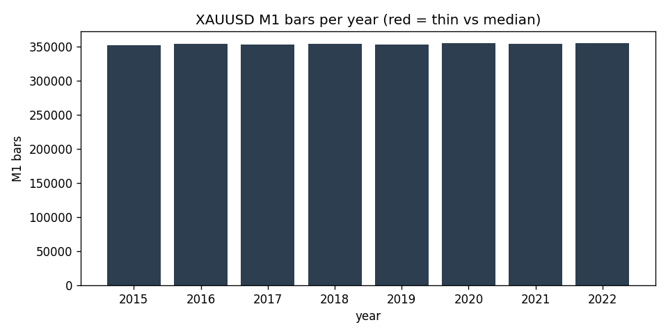

# Data-Quality Report — XAUUSD M1 (IN-SAMPLE (2015-2022))

> Generated by `scripts/build_quality_report.py`. Gaps and anomalies are **reported, not patched** (see `docs/SPEC.md` §1.4).

## Overview

- Bars (M1): **2,826,092**
- Range: `2015-01-01 23:01:00+00:00` -> `2022-12-30 21:57:00+00:00` (UTC)
- Timezone: UTC (source HistData fixed EST, UTC-5, no DST)
- Session anchor (D1/W1): **ny_close** (17:00 America/New_York close, DST-aware)

## Per-year M1 bars

| year | bars | % of median | thin? |
|---|---:|---:|:--:|
| 2015 | 351,666 | 99.5% |  |
| 2016 | 353,415 | 100.0% |  |
| 2017 | 352,360 | 99.7% |  |
| 2018 | 353,778 | 100.1% |  |
| 2019 | 352,628 | 99.8% |  |
| 2020 | 354,291 | 100.3% |  |
| 2021 | 353,386 | 100.0% |  |
| 2022 | 354,568 | 100.3% |  |

## Gaps (inter-bar)

- Intrabar gaps > 5 min: **2,130**
- Session gaps > 1 h: **2,074**
- Weekend/holiday gaps > 24 h: **421**
- Largest gap: **76.3 h** (resumes at `2015-12-27 23:01:00+00:00`)

### 10 largest gaps

| gap_start | resumes_at | gap_hours |
|---|---|---:|
| `2020-12-24 18:44:00+00:00` | `2020-12-27 23:00:00+00:00` | 76.27 |
| `2015-12-24 18:45:00+00:00` | `2015-12-27 23:01:00+00:00` | 76.27 |
| `2016-12-30 21:48:00+00:00` | `2017-01-02 23:01:00+00:00` | 73.22 |
| `2016-03-24 21:58:00+00:00` | `2016-03-27 23:01:00+00:00` | 73.05 |
| `2015-12-31 21:58:00+00:00` | `2016-01-03 23:01:00+00:00` | 73.05 |
| `2017-12-29 21:58:00+00:00` | `2018-01-01 23:01:00+00:00` | 73.05 |
| `2017-04-13 21:59:00+00:00` | `2017-04-16 23:01:00+00:00` | 73.03 |
| `2020-12-31 21:58:00+00:00` | `2021-01-03 23:00:00+00:00` | 73.03 |
| `2022-04-14 21:58:00+00:00` | `2022-04-17 23:00:00+00:00` | 73.03 |
| `2017-12-22 21:59:00+00:00` | `2017-12-25 23:01:00+00:00` | 73.03 |

## Integrity

- duplicate_timestamps: **0**
- index_monotonic_increasing: **True**
- ohlc_violations: **0**
- rows_with_nan_ohlc: **0**

## Largest M1 moves (bad-print / rollover scan)

Largest |close-to-close| M1 moves, reviewed for clipped/garbage prints and contract-rollover jumps (reported, not patched).

| at (UTC) | prev_close | close | % move |
|---|---:|---:|---:|
| `2021-08-08 23:57:00+00:00` | 1716 | 1670.5 | 2.650% |
| `2015-07-20 02:29:00+00:00` | 1129.5 | 1102.3 | 2.405% |
| `2020-03-15 22:00:00+00:00` | 1529.3 | 1563.8 | 2.253% |
| `2022-02-27 23:00:00+00:00` | 1888.5 | 1921.3 | 1.735% |
| `2015-11-06 13:30:00+00:00` | 1106.8 | 1091.4 | 1.396% |
| `2020-03-08 22:01:00+00:00` | 1673.5 | 1696.5 | 1.374% |
| `2016-09-02 13:30:00+00:00` | 1307.7 | 1325.2 | 1.334% |
| `2016-07-08 13:30:00+00:00` | 1356.7 | 1338.8 | 1.324% |
| `2019-06-30 23:00:00+00:00` | 1409.5 | 1391.2 | 1.300% |
| `2022-11-10 13:30:00+00:00` | 1711.4 | 1733.4 | 1.288% |
| `2021-08-09 00:03:00+00:00` | 1681.7 | 1702.8 | 1.258% |
| `2015-07-20 02:35:00+00:00` | 1105.4 | 1092.9 | 1.132% |

## Resampled bar counts

| timeframe | bars | start | end |
|---|---:|---|---|
| W1 | 418 | `2014-12-28 22:00:00+00:00` | `2022-12-25 22:00:00+00:00` |
| D1 | 2,320 | `2015-01-01 22:00:00+00:00` | `2022-12-29 22:00:00+00:00` |
| H4 | 12,783 | `2015-01-01 20:00:00+00:00` | `2022-12-30 20:00:00+00:00` |
| H1 | 47,453 | `2015-01-01 23:00:00+00:00` | `2022-12-30 21:00:00+00:00` |
| M15 | 189,034 | `2015-01-01 23:00:00+00:00` | `2022-12-30 21:45:00+00:00` |
| M5 | 566,531 | `2015-01-01 23:00:00+00:00` | `2022-12-30 21:55:00+00:00` |
| M1 | 2,826,092 | `2015-01-01 23:01:00+00:00` | `2022-12-30 21:57:00+00:00` |
