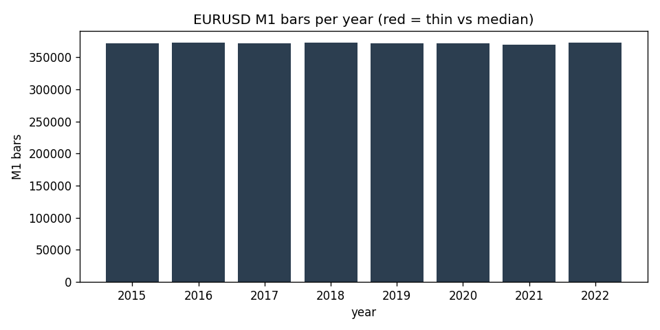

# Data-Quality Report — EURUSD M1 (IN-SAMPLE (2015-2022))

> Generated by `scripts/build_quality_report.py`. Gaps and anomalies are **reported, not patched** (see `docs/SPEC.md` §1.4).

## Overview

- Bars (M1): **2,976,123**
- Range: `2015-01-01 18:00:00+00:00` -> `2022-12-30 21:58:00+00:00` (UTC)
- Timezone: UTC (source HistData fixed EST, UTC-5, no DST)
- Session anchor (D1/W1): **ny_close** (17:00 America/New_York close, DST-aware)

## Per-year M1 bars

| year | bars | % of median | thin? |
|---|---:|---:|:--:|
| 2015 | 372,210 | 100.0% |  |
| 2016 | 372,679 | 100.1% |  |
| 2017 | 371,635 | 99.8% |  |
| 2018 | 372,607 | 100.1% |  |
| 2019 | 372,470 | 100.0% |  |
| 2020 | 372,275 | 100.0% |  |
| 2021 | 369,442 | 99.2% |  |
| 2022 | 372,805 | 100.1% |  |

## Gaps (inter-bar)

- Intrabar gaps > 5 min: **515**
- Session gaps > 1 h: **430**
- Weekend/holiday gaps > 24 h: **419**
- Largest gap: **75.1 h** (resumes at `2015-12-27 22:07:00+00:00`)

### 10 largest gaps

| gap_start | resumes_at | gap_hours |
|---|---|---:|
| `2015-12-24 18:59:00+00:00` | `2015-12-27 22:07:00+00:00` | 75.13 |
| `2017-12-29 21:57:00+00:00` | `2018-01-01 22:00:00+00:00` | 72.05 |
| `2015-12-31 21:58:00+00:00` | `2016-01-03 22:00:00+00:00` | 72.03 |
| `2020-12-31 21:58:00+00:00` | `2021-01-03 22:00:00+00:00` | 72.03 |
| `2017-12-22 21:59:00+00:00` | `2017-12-25 22:00:00+00:00` | 72.02 |
| `2020-12-25 07:59:00+00:00` | `2020-12-27 22:06:00+00:00` | 62.12 |
| `2016-12-30 21:58:00+00:00` | `2017-01-02 07:00:00+00:00` | 57.03 |
| `2019-05-24 21:59:00+00:00` | `2019-05-27 04:00:00+00:00` | 54.02 |
| `2020-03-27 20:59:00+00:00` | `2020-03-29 22:01:00+00:00` | 49.03 |
| `2022-11-04 20:59:00+00:00` | `2022-11-06 22:00:00+00:00` | 49.02 |

## Integrity

- duplicate_timestamps: **0**
- index_monotonic_increasing: **True**
- ohlc_violations: **0**
- rows_with_nan_ohlc: **0**

## Largest M1 moves (bad-print / rollover scan)

Largest |close-to-close| M1 moves, reviewed for clipped/garbage prints and contract-rollover jumps (reported, not patched).

| at (UTC) | prev_close | close | % move |
|---|---:|---:|---:|
| `2017-04-23 22:00:00+00:00` | 1.0724 | 1.0908 | 1.719% |
| `2015-06-28 22:00:00+00:00` | 1.1166 | 1.1005 | 1.445% |
| `2015-11-06 13:30:00+00:00` | 1.0853 | 1.0715 | 1.274% |
| `2022-02-27 22:00:00+00:00` | 1.1272 | 1.1128 | 1.272% |
| `2015-07-05 22:00:00+00:00` | 1.1113 | 1.099 | 1.110% |
| `2015-03-18 21:04:00+00:00` | 1.092 | 1.1038 | 1.081% |
| `2022-11-10 13:30:00+00:00` | 0.99573 | 1.0061 | 1.041% |
| `2016-06-26 22:00:00+00:00` | 1.1116 | 1.1008 | 0.977% |
| `2015-04-03 13:30:00+00:00` | 1.0886 | 1.0988 | 0.939% |
| `2015-06-05 13:30:00+00:00` | 1.122 | 1.1117 | 0.916% |
| `2015-03-06 13:31:00+00:00` | 1.0981 | 1.0885 | 0.874% |
| `2022-10-13 13:30:00+00:00` | 0.97365 | 0.96517 | 0.871% |

## Resampled bar counts

| timeframe | bars | start | end |
|---|---:|---|---|
| W1 | 418 | `2014-12-28 22:00:00+00:00` | `2022-12-25 22:00:00+00:00` |
| D1 | 2,338 | `2014-12-31 22:00:00+00:00` | `2022-12-29 22:00:00+00:00` |
| H4 | 12,869 | `2015-01-01 16:00:00+00:00` | `2022-12-30 20:00:00+00:00` |
| H1 | 49,773 | `2015-01-01 18:00:00+00:00` | `2022-12-30 21:00:00+00:00` |
| M15 | 199,081 | `2015-01-01 18:00:00+00:00` | `2022-12-30 21:45:00+00:00` |
| M5 | 597,186 | `2015-01-01 18:00:00+00:00` | `2022-12-30 21:55:00+00:00` |
| M1 | 2,976,123 | `2015-01-01 18:00:00+00:00` | `2022-12-30 21:58:00+00:00` |
