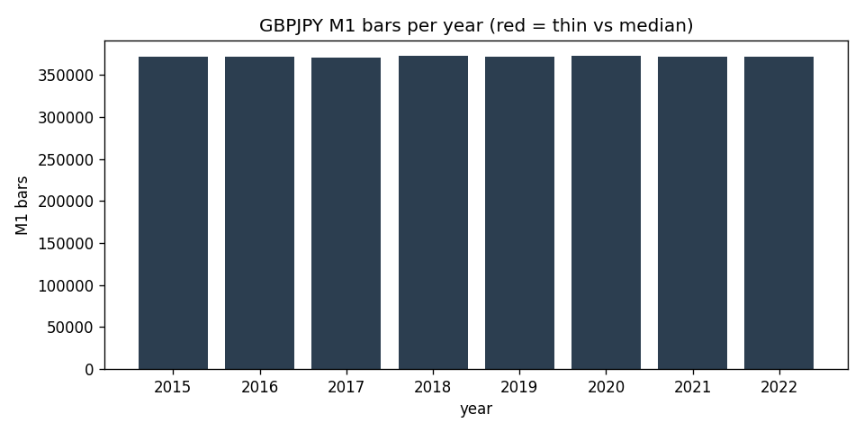

# Data-Quality Report — GBPJPY M1 (IN-SAMPLE (2015-2022))

> Generated by `scripts/build_quality_report.py`. Gaps and anomalies are **reported, not patched** (see `docs/SPEC.md` §1.4).

## Overview

- Bars (M1): **2,975,101**
- Range: `2015-01-01 18:39:00+00:00` -> `2022-12-30 21:58:00+00:00` (UTC)
- Timezone: UTC (source HistData fixed EST, UTC-5, no DST)
- Session anchor (D1/W1): **ny_close** (17:00 America/New_York close, DST-aware)

## Per-year M1 bars

| year | bars | % of median | thin? |
|---|---:|---:|:--:|
| 2015 | 371,946 | 100.0% |  |
| 2016 | 371,282 | 99.8% |  |
| 2017 | 370,949 | 99.7% |  |
| 2018 | 372,495 | 100.1% |  |
| 2019 | 372,042 | 100.0% |  |
| 2020 | 372,649 | 100.2% |  |
| 2021 | 371,509 | 99.9% |  |
| 2022 | 372,229 | 100.1% |  |

## Gaps (inter-bar)

- Intrabar gaps > 5 min: **727**
- Session gaps > 1 h: **432**
- Weekend/holiday gaps > 24 h: **419**
- Largest gap: **75.1 h** (resumes at `2015-12-27 22:07:00+00:00`)

### 10 largest gaps

| gap_start | resumes_at | gap_hours |
|---|---|---:|
| `2015-12-24 18:59:00+00:00` | `2015-12-27 22:07:00+00:00` | 75.13 |
| `2017-12-29 21:55:00+00:00` | `2018-01-01 22:02:00+00:00` | 72.12 |
| `2017-12-22 21:58:00+00:00` | `2017-12-25 22:02:00+00:00` | 72.07 |
| `2015-12-31 21:57:00+00:00` | `2016-01-03 22:00:00+00:00` | 72.05 |
| `2020-12-31 21:58:00+00:00` | `2021-01-03 22:00:00+00:00` | 72.03 |
| `2020-12-25 07:23:00+00:00` | `2020-12-27 22:04:00+00:00` | 62.68 |
| `2016-12-30 21:55:00+00:00` | `2017-01-02 07:00:00+00:00` | 57.08 |
| `2019-05-24 21:59:00+00:00` | `2019-05-27 06:00:00+00:00` | 56.02 |
| `2022-03-25 20:59:00+00:00` | `2022-03-27 22:06:00+00:00` | 49.12 |
| `2020-03-27 20:59:00+00:00` | `2020-03-29 22:06:00+00:00` | 49.12 |

## Integrity

- duplicate_timestamps: **0**
- index_monotonic_increasing: **True**
- ohlc_violations: **0**
- rows_with_nan_ohlc: **0**

## Largest M1 moves (bad-print / rollover scan)

Largest |close-to-close| M1 moves, reviewed for clipped/garbage prints and contract-rollover jumps (reported, not patched).

| at (UTC) | prev_close | close | % move |
|---|---:|---:|---:|
| `2016-06-26 22:01:00+00:00` | 139.84 | 136.19 | 2.614% |
| `2016-06-24 03:43:00+00:00` | 139.86 | 136.67 | 2.285% |
| `2016-06-24 02:09:00+00:00` | 145.66 | 148.97 | 2.272% |
| `2016-06-24 00:17:00+00:00` | 155.73 | 152.3 | 2.201% |
| `2016-10-07 00:07:00+00:00` | 130.98 | 128.25 | 2.082% |
| `2016-07-29 04:46:00+00:00` | 138.85 | 136.35 | 1.801% |
| `2016-04-28 04:01:00+00:00` | 162.25 | 159.35 | 1.786% |
| `2022-09-26 01:59:00+00:00` | 152.16 | 149.54 | 1.719% |
| `2017-01-15 22:01:00+00:00` | 139.56 | 137.2 | 1.692% |
| `2019-01-02 22:42:00+00:00` | 134.98 | 132.7 | 1.691% |
| `2019-12-12 22:01:00+00:00` | 143.91 | 146.29 | 1.657% |
| `2016-06-24 00:18:00+00:00` | 152.3 | 149.88 | 1.586% |

## Resampled bar counts

| timeframe | bars | start | end |
|---|---:|---|---|
| W1 | 418 | `2014-12-28 22:00:00+00:00` | `2022-12-25 22:00:00+00:00` |
| D1 | 2,338 | `2014-12-31 22:00:00+00:00` | `2022-12-29 22:00:00+00:00` |
| H4 | 12,869 | `2015-01-01 16:00:00+00:00` | `2022-12-30 20:00:00+00:00` |
| H1 | 49,769 | `2015-01-01 18:00:00+00:00` | `2022-12-30 21:00:00+00:00` |
| M15 | 199,050 | `2015-01-01 18:30:00+00:00` | `2022-12-30 21:45:00+00:00` |
| M5 | 596,705 | `2015-01-01 18:35:00+00:00` | `2022-12-30 21:55:00+00:00` |
| M1 | 2,975,101 | `2015-01-01 18:39:00+00:00` | `2022-12-30 21:58:00+00:00` |
