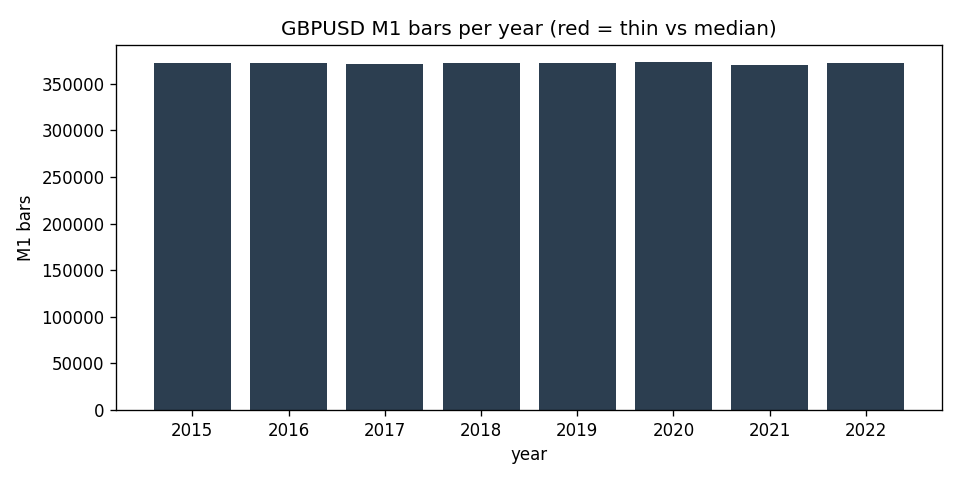

# Data-Quality Report — GBPUSD M1 (IN-SAMPLE (2015-2022))

> Generated by `scripts/build_quality_report.py`. Gaps and anomalies are **reported, not patched** (see `docs/SPEC.md` §1.4).

## Overview

- Bars (M1): **2,976,281**
- Range: `2015-01-01 18:01:00+00:00` -> `2022-12-30 21:58:00+00:00` (UTC)
- Timezone: UTC (source HistData fixed EST, UTC-5, no DST)
- Session anchor (D1/W1): **ny_close** (17:00 America/New_York close, DST-aware)

## Per-year M1 bars

| year | bars | % of median | thin? |
|---|---:|---:|:--:|
| 2015 | 372,231 | 100.0% |  |
| 2016 | 372,480 | 100.0% |  |
| 2017 | 371,204 | 99.7% |  |
| 2018 | 372,261 | 100.0% |  |
| 2019 | 372,336 | 100.0% |  |
| 2020 | 372,997 | 100.2% |  |
| 2021 | 370,338 | 99.5% |  |
| 2022 | 372,434 | 100.0% |  |

## Gaps (inter-bar)

- Intrabar gaps > 5 min: **569**
- Session gaps > 1 h: **432**
- Weekend/holiday gaps > 24 h: **419**
- Largest gap: **75.1 h** (resumes at `2015-12-27 22:06:00+00:00`)

### 10 largest gaps

| gap_start | resumes_at | gap_hours |
|---|---|---:|
| `2015-12-24 18:59:00+00:00` | `2015-12-27 22:06:00+00:00` | 75.12 |
| `2017-12-29 21:57:00+00:00` | `2018-01-01 22:00:00+00:00` | 72.05 |
| `2020-12-31 21:58:00+00:00` | `2021-01-03 22:00:00+00:00` | 72.03 |
| `2015-12-31 21:58:00+00:00` | `2016-01-03 22:00:00+00:00` | 72.03 |
| `2017-12-22 21:59:00+00:00` | `2017-12-25 22:00:00+00:00` | 72.02 |
| `2020-12-25 06:56:00+00:00` | `2020-12-27 22:00:00+00:00` | 63.07 |
| `2016-12-30 21:57:00+00:00` | `2017-01-02 07:00:00+00:00` | 57.05 |
| `2019-05-24 21:59:00+00:00` | `2019-05-27 05:00:00+00:00` | 55.02 |
| `2020-03-27 20:59:00+00:00` | `2020-03-29 22:06:00+00:00` | 49.12 |
| `2022-03-25 20:59:00+00:00` | `2022-03-27 22:01:00+00:00` | 49.03 |

## Integrity

- duplicate_timestamps: **0**
- index_monotonic_increasing: **True**
- ohlc_violations: **0**
- rows_with_nan_ohlc: **0**

## Largest M1 moves (bad-print / rollover scan)

Largest |close-to-close| M1 moves, reviewed for clipped/garbage prints and contract-rollover jumps (reported, not patched).

| at (UTC) | prev_close | close | % move |
|---|---:|---:|---:|
| `2016-06-24 00:17:00+00:00` | 1.475 | 1.4325 | 2.882% |
| `2016-10-07 00:13:00+00:00` | 1.2341 | 1.2048 | 2.377% |
| `2016-10-07 00:07:00+00:00` | 1.2602 | 1.2341 | 2.070% |
| `2016-06-26 22:00:00+00:00` | 1.367 | 1.3421 | 1.818% |
| `2022-09-26 01:59:00+00:00` | 1.0569 | 1.04 | 1.599% |
| `2017-01-15 22:00:00+00:00` | 1.2179 | 1.1995 | 1.508% |
| `2019-12-12 22:00:00+00:00` | 1.3158 | 1.3349 | 1.452% |
| `2016-10-07 00:15:00+00:00` | 1.2042 | 1.2203 | 1.338% |
| `2016-06-24 02:09:00+00:00` | 1.4076 | 1.4262 | 1.326% |
| `2017-06-08 22:00:00+00:00` | 1.2959 | 1.2794 | 1.279% |
| `2016-06-24 02:23:00+00:00` | 1.4259 | 1.4419 | 1.121% |
| `2022-09-28 11:02:00+00:00` | 1.0709 | 1.0828 | 1.117% |

## Resampled bar counts

| timeframe | bars | start | end |
|---|---:|---|---|
| W1 | 418 | `2014-12-28 22:00:00+00:00` | `2022-12-25 22:00:00+00:00` |
| D1 | 2,338 | `2014-12-31 22:00:00+00:00` | `2022-12-29 22:00:00+00:00` |
| H4 | 12,869 | `2015-01-01 16:00:00+00:00` | `2022-12-30 20:00:00+00:00` |
| H1 | 49,769 | `2015-01-01 18:00:00+00:00` | `2022-12-30 21:00:00+00:00` |
| M15 | 199,064 | `2015-01-01 18:00:00+00:00` | `2022-12-30 21:45:00+00:00` |
| M5 | 597,032 | `2015-01-01 18:00:00+00:00` | `2022-12-30 21:55:00+00:00` |
| M1 | 2,976,281 | `2015-01-01 18:01:00+00:00` | `2022-12-30 21:58:00+00:00` |
