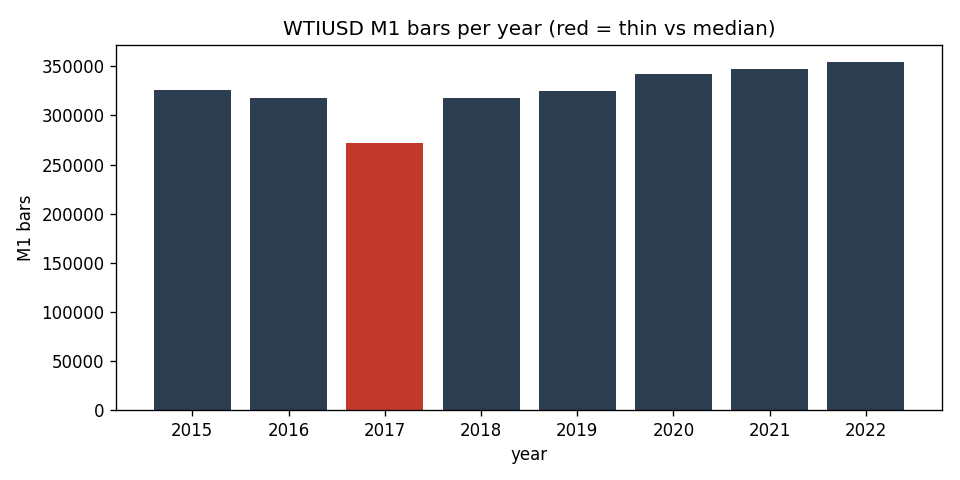

# Data-Quality Report — WTIUSD M1 (IN-SAMPLE (2015-2022))

> Generated by `scripts/build_quality_report.py`. Gaps and anomalies are **reported, not patched** (see `docs/SPEC.md` §1.4).

## Overview

- Bars (M1): **2,601,784**
- Range: `2015-01-01 23:00:00+00:00` -> `2022-12-30 21:57:00+00:00` (UTC)
- Timezone: UTC (source HistData fixed EST, UTC-5, no DST)
- Session anchor (D1/W1): **ny_close** (17:00 America/New_York close, DST-aware)

## Per-year M1 bars

| year | bars | % of median | thin? |
|---|---:|---:|:--:|
| 2015 | 326,253 | 100.2% |  |
| 2016 | 317,338 | 97.5% |  |
| 2017 | 271,477 | 83.4% | ⚠️ thin |
| 2018 | 318,142 | 97.7% |  |
| 2019 | 324,986 | 99.8% |  |
| 2020 | 342,633 | 105.2% |  |
| 2021 | 346,791 | 106.5% |  |
| 2022 | 354,164 | 108.8% |  |

## Gaps (inter-bar)

- Intrabar gaps > 5 min: **8,545**
- Session gaps > 1 h: **1,684**
- Weekend/holiday gaps > 24 h: **420**
- Largest gap: **217.0 h** (resumes at `2017-02-26 23:00:00+00:00`)

### 10 largest gaps

| gap_start | resumes_at | gap_hours |
|---|---|---:|
| `2017-02-17 21:59:00+00:00` | `2017-02-26 23:00:00+00:00` | 217.02 |
| `2015-12-24 18:44:00+00:00` | `2015-12-27 23:00:00+00:00` | 76.27 |
| `2020-12-24 18:44:00+00:00` | `2020-12-27 23:00:00+00:00` | 76.27 |
| `2019-04-18 19:29:00+00:00` | `2019-04-21 23:00:00+00:00` | 75.52 |
| `2022-04-14 21:39:00+00:00` | `2022-04-17 23:00:00+00:00` | 73.35 |
| `2021-12-23 21:58:00+00:00` | `2021-12-26 23:00:00+00:00` | 73.03 |
| `2017-12-29 21:58:00+00:00` | `2018-01-01 23:00:00+00:00` | 73.03 |
| `2022-12-23 21:58:00+00:00` | `2022-12-26 23:00:00+00:00` | 73.03 |
| `2016-12-30 21:58:00+00:00` | `2017-01-02 23:00:00+00:00` | 73.03 |
| `2020-12-31 21:58:00+00:00` | `2021-01-03 23:00:00+00:00` | 73.03 |

## Integrity

- duplicate_timestamps: **0**
- index_monotonic_increasing: **True**
- ohlc_violations: **0**
- rows_with_nan_ohlc: **0**

## Largest M1 moves (bad-print / rollover scan)

Largest |close-to-close| M1 moves, reviewed for clipped/garbage prints and contract-rollover jumps (reported, not patched).

| at (UTC) | prev_close | close | % move |
|---|---:|---:|---:|
| `2020-04-19 23:00:00+00:00` | 18.31 | 24.72 | 35.008% |
| `2020-03-08 22:02:00+00:00` | 41.586 | 30.051 | 27.738% |
| `2020-04-21 18:53:00+00:00` | 7.135 | 8.65 | 21.233% |
| `2020-04-21 18:49:00+00:00` | 8.055 | 6.495 | 19.367% |
| `2020-04-21 18:48:00+00:00` | 9.89 | 8.055 | 18.554% |
| `2020-04-21 19:23:00+00:00` | 11.665 | 13.575 | 16.374% |
| `2020-04-21 10:33:00+00:00` | 14.095 | 11.925 | 15.396% |
| `2019-09-15 23:02:00+00:00` | 54.915 | 62.075 | 13.038% |
| `2020-04-21 18:51:00+00:00` | 6.565 | 7.365 | 12.186% |
| `2020-04-05 23:00:00+00:00` | 28.96 | 25.525 | 11.861% |
| `2020-04-21 18:45:00+00:00` | 10.44 | 9.375 | 10.201% |
| `2020-04-02 15:37:00+00:00` | 24.205 | 26.425 | 9.172% |

## Resampled bar counts

| timeframe | bars | start | end |
|---|---:|---|---|
| W1 | 417 | `2014-12-28 22:00:00+00:00` | `2022-12-25 22:00:00+00:00` |
| D1 | 2,313 | `2015-01-01 22:00:00+00:00` | `2022-12-29 22:00:00+00:00` |
| H4 | 12,750 | `2015-01-01 20:00:00+00:00` | `2022-12-30 20:00:00+00:00` |
| H1 | 47,463 | `2015-01-01 23:00:00+00:00` | `2022-12-30 21:00:00+00:00` |
| M15 | 188,469 | `2015-01-01 23:00:00+00:00` | `2022-12-30 21:45:00+00:00` |
| M5 | 560,825 | `2015-01-01 23:00:00+00:00` | `2022-12-30 21:55:00+00:00` |
| M1 | 2,601,784 | `2015-01-01 23:00:00+00:00` | `2022-12-30 21:57:00+00:00` |
