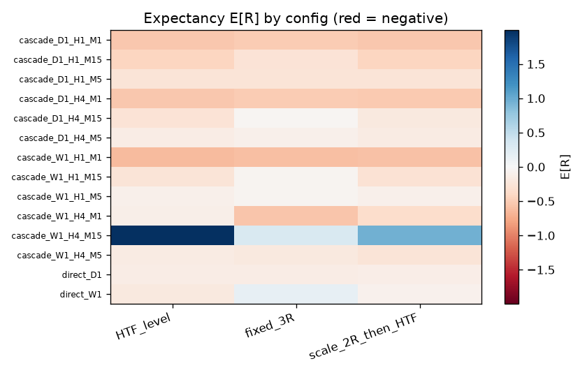
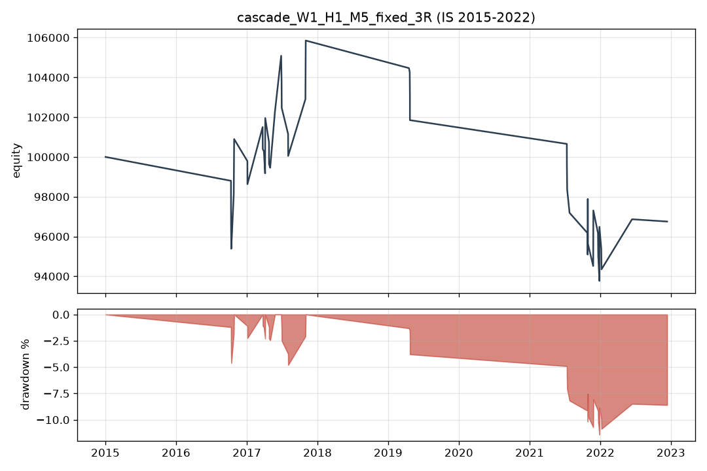
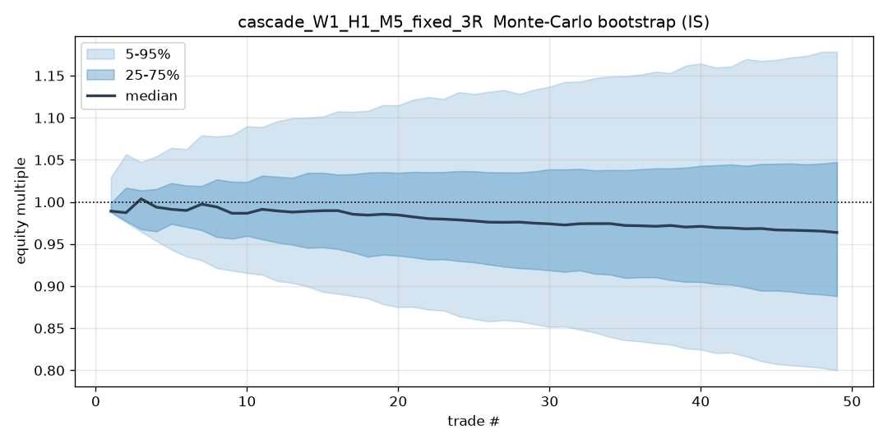

# Does a Multi-Timeframe SMC Price-Action Strategy Have an Edge on XAUUSD? A Falsification Study

**Verdict: No confirmable edge.** Across 42 pre-registered structural variants of a top-down
Smart-Money-Concepts (SMC) strategy on gold, evaluated 2015–2022 in-sample with realistic costs,
look-ahead tests, Monte-Carlo, a two-null random-entry benchmark, walk-forward, and
Benjamini–Hochberg + Deflated-Sharpe correction, **no configuration shows a statistically real edge**,
and a single pre-registered out-of-sample evaluation (2023–2025) does not change that conclusion.

> **Re-run (2026-09-27).** The in-sample figures in §5–§6 are from the re-run on the corrected engine
> ([`ADDENDUM_2026-09-27.md`](ADDENDUM_2026-09-27.md) §11); the one-time OOS figure (§7) predates the
> fix and is not recomputed.

---

## 1. Research question
Does a discretionary-style, multi-timeframe SMC price-action model — HTF point-of-interest + EMA bias
→ MTF break-of-structure/change-of-character with a fair-value gap → discount/premium pullback → LTF
trigger — carry a **statistically real, cost-surviving edge** on XAUUSD, once tested honestly across a
grid of structural variants with multiple-testing correction? This is a **falsification** study: a
clean negative result is the goal if that is what the data shows. Parameters were never tuned toward
profitability.

## 2. Data
- **XAUUSD M1 OHLC, 2015-01-01 → 2025-12-31 UTC** (3,844,387 bars). Source: HistData.com, fixed
  **EST (UTC−5, no DST)** → converted to UTC. 2015–2023 from the XLSX feed, 2024–2025 from the
  MetaTrader CSV feed (`scripts/ingest_oos_data.py`); integrity clean (0 NaN, 0 OHLC violations).
- **Timeframes** W1/D1/H4/H1/M15/M5/M1 by resampling M1. **D1/W1 use the gold/FX convention — the
  17:00 New-York close, DST-aware** (21:00 UTC summer / 22:00 UTC winter), distinct from the
  fixed-EST source; intraday is UTC-binned. (`docs/DATA_QUALITY.md`, `mtf_smc/sessions.py`.)
- **In-sample 2015–2022; out-of-sample 2023–2025, locked.** The IS loader **hard-slices to
  `< 2023-01-01`** structurally (unit-tested), so OOS rows cannot enter development. OOS was unsealed
  **once**, for the finalist only (§8). 2023 is ~12% thin (a HistData artifact); 2024/2025 are full
  ~354k-bar years.

## 3. Strategy and the 42-config grid
Every SMC primitive is defined concretely and unit-tested (`docs/SPEC.md` §2; swings, FVG, BOS/CHoCH,
discount/premium Fib anchor, POI + mitigation, Wilder ATR, EMA-55/144 Vegas bias). Two entry models:
**cascade** (A) and **direct POI** (B); three take-profit modes (fixed 3R; a frozen-at-entry HTF key
level; 50% scale at 2R then HTF level). Risk = 1% equity/trade; breakeven at +2R.

**Primary grid = 42 configs** (`docs/SPEC.md` §4): cascade `2 htf × 2 mtf × 3 ltf × 3 tp = 36` +
direct `2 htf × 3 tp = 6`. The trial count (42) is fed explicitly into the multiple-testing
correction. Secondary ablations are reserved for strong survivors — of which there are none.

## 4. Methodology — why the numbers are trustworthy
- **Look-ahead tests.** Higher-TF reads are gated on each bar's close time, so a decision at `t` is
  meant to see only bars closed by `t`. ATR, EMA, swings, FVG and structure have
  **truncation-invariance tests** (recomputing on the prefix `[0..i]` must reproduce history exactly),
  and an end-to-end test on real data checks that trades resolved within a prefix are unchanged when
  the future is deleted. Two paths were not covered and did look ahead — the take-profit swing target
  and the order of fill vs. close-based invalidation — and were fixed on 2026-09-27 (see the correction
  above); the tests now cover them.
- **Intrabar fills on M1.** Limit fills, stops, take-profits, breakeven moves, and scale-outs are
  resolved by stepping the underlying M1 bars; a documented **same-bar SL/TP tie-break** (stop-first,
  worst case). A limit fills only if M1 actually trades through it.
- **Costs modelled and attributed.** Half-spread per side ($0.20 spread), $7 round-turn commission,
  $0.05/side slippage, and overnight swap — applied **exactly once per fill** (verified by an
  independent fill-based recompute matching the line-item net on worked examples). A
  **high-slippage-on-stops** sensitivity ($0.50/side) is available.
- **Statistics.** Per-config bootstrap CIs and p-values on expectancy; a **drop-1** tail check;
  **Monte-Carlo** (reshuffle + bootstrap) for path/drawdown risk; a **two-null random-entry**
  benchmark for edge (below); **Benjamini–Hochberg FDR** + **Deflated/Probabilistic Sharpe** over the
  42 trials. Sharpe convention: daily business-day mark-to-market equity, ×√252 (used for
  DSR/PSR/FDR); the random-entry **edge** metric is per-trade E[R] and per-trade Sharpe (cadence-robust).
- **Tested (90 unit tests) and reproducible** (fixed seeds, config snapshots, bit-identical
  optimizations verified by MD5/`<1e-9`).

## 5. In-sample results (2015–2022) — no edge



- **0 / 42 configurations survive Benjamini–Hochberg FDR** (no mean R > 0 after correction).
- **Every expectancy CI crosses zero** — *zero* configs have a 95% CI entirely above 0.
- **max Deflated Sharpe = 0.00** — no config's Sharpe is significant after deflation by 42 trials
  (best raw Sharpe +0.43).
- Only **4/42 have a positive point estimate, none with N ≥ 30** — small-sample noise (the best,
  `cascade_W1_H4_M15_HTF_level` at +2.0R, is **17 trades**, CI [−0.63, +5.27]).
- The high-N **M1-LTF cascades** (the D1-HTF ones, N 1,048–1,192) are firmly negative (E[R] −0.50 to
  −0.54, Sharpe −2.2 to −2.9, win rate 17–19 % on the fixed-3R and HTF targets) with CIs **entirely below
  zero** — costs + a low hit-rate on 3R/HTF targets. This is structural, not a cost double-charge (the
  pre-fix gross/net split, not recomputed in the re-run: ≈ −0.25R gross before costs, + ~0.1–0.2R/trade
  realistic cost on tight M1 stops).

## 6. Robustness

**Random-entry decomposition (report-grade, 1000 nulls per null; `output/robustness/random_entry.csv`).**
For the three survivors (N ≥ 30, least-negative E[R]), the strategy's per-trade E[R] is *less* negative
than the mean of both nulls — the finalist `cascade_W1_H1_M5_fixed_3R`: strategy −0.053 vs bias-matched
null −0.195 (**+0.142R**); `cascade_D1_H4_M15_fixed_3R`: −0.043 vs −0.131 (**+0.088R**);
`cascade_D1_H4_M5_fixed_3R`: −0.103 vs −0.215 (**+0.112R**). But on E[R] the strategy sits at only
the **72nd–91st percentile** of the bias-matched null (76th–93rd of the unconstrained one), inside each
null's 5–95 % band: on expectancy the entries are **not distinguishable from random entries** under the
same trend filter. On per-trade Sharpe, `cascade_D1_H4_M5_fixed_3R` reaches the 96th percentile of both
nulls (the other two: 74th–83rd) — one of six comparisons, uncorrected for multiplicity. The gap is also an upper bound — the holding-time match is imperfect (random entries stop out far
sooner: median holding 182 vs 52, 90 vs 27, 80 vs 26 bars) — and the strategy remains **net-negative**.

**Monte-Carlo drawdown (the three survivors).** Bootstrap median max-drawdown −13.4 %, −12.5 % and
−34.2 % (5th percentile −24.4 %, −22.7 %, −52.8 %); probability of a ≥20 % drawdown 0.16, 0.11 and 0.91
for `cascade_D1_H4_M15_fixed_3R`, `cascade_W1_H1_M5_fixed_3R` and `cascade_D1_H4_M5_fixed_3R`. Point
estimates near zero still hide deep drawdowns. The fat-tail case is `cascade_W1_H4_M1_HTF_level`
(no longer a survivor): E[R] −0.112 on a **4.0 % win rate** with a +25.5R average win and a −66 %
realised max-drawdown — a handful of huge "high-R:R" hits prop up the mean while the equity bleeds
between them. Tail-driven, not edge-driven.

**Walk-forward / regime.** Across the survivors, the quiet **2015–2018 range** is the only regime with
a positive E[R] (+0.161 and +0.255R; −0.109R for `cascade_D1_H4_M5_fixed_3R`), **2019–2020 COVID** is
negative (−1.137, −0.959, −0.199R) and so is the **2021–2022 bull** (−0.153, −0.233, −0.063R). **No
yearly CI lies entirely above zero**; the few that exclude zero lie below it (small-N years in which
every trade lost, and 2016 for `cascade_D1_H4_M5_fixed_3R`, N 25, E[R] −0.659R). No stable
out-of-sample signal in time.

**Mechanics sanity (illustrative).** A `scale_2R_then_HTF` trade that scaled 50% at +2R then stopped
at breakeven nets **+0.891R** (independent fill-based recheck matches) — the expected ≈ +1R minus
cost drag.




## 7. Out-of-sample (2023–2025) — touched once
The finalist was selected **purely by the pre-registered IS rule** (N ≥ 30, least-negative E[R]) →
`cascade_W1_H1_M5_fixed_3R`, **before the OOS was unsealed**. It was the **only** config evaluated on
OOS. (The 2024–2025 ingest earlier was hygiene only — no strategy contact — and the IS slice is
bit-identical to the original seed; OOS played **no role** in any parameter or methodology choice.)

| Window | N | win% | E[R] | 95% CI | p(mean>0) | PF | Sharpe |
|---|---:|---:|---:|---|---:|---:|---:|
| IS 2015–2022 (consistency) | 49 | 24.5% | −0.053 | [−0.50, +0.43] | 0.610 | 0.93 | +0.03 |
| **OOS 2023–2025** | **7** | 42.9% | **+0.623** | **[−0.54, +2.32]** | **0.124** | 2.01 | +1.68 |

The OOS **point estimate is positive** (+0.62R, PF 2.0, Sharpe +1.68) — and this is precisely the
discipline test. With **N = 7** (the deep W1→H1→M5 cascade is trade-starved; all seven fell in 2023,
none in 2024–25), a **CI of [−0.54, +2.32] that crosses zero**, and **p = 0.124**, it is statistically
indistinguishable from no edge. Per the pre-registered interpretation rule, **one noisy 7-trade sample
on one config cannot overturn 42 in-sample configs + multiple-testing correction.** It is a single
data point, not a discovered edge.

## 8. Limitations
- **Spread/slippage are modelled** (raw OHLC carries none); swap timing is an approximate placeholder.
  Conclusions assume retail-ECN-like costs.
- **Single instrument.** Professional trend/structure trading is multi-asset and diversified; this
  studies XAUUSD alone.
- **SMC discretion is operationalized into specific testable rules** (`docs/SPEC.md`). Other defensible
  definitions exist; the grid + ablations explore the main forks, not all of them.
- **Deep cascades are trade-starved** (W1→M1 etc.), so some configs are statistically weak by
  construction — flagged throughout (min-N=30).
- The random-entry holding-time match is imperfect (random entries stop out sooner), so the
  structure-vs-random gap is an upper bound on entry quality.
- **High slippage on stops (stop slippage ×10, pre-registered in `docs/SPEC.md` §6.5; run in the
  2026-09-27 re-run, `output/grid/stopslip_x10/master_table.csv`):** 0/42 BH-FDR survivors, max DSR
  0.00, 4/42 positive point estimates (largest +1.844R, smallest p = 0.116) — the conclusion does not
  change under it.

## 9. Conclusion
A rigorously, honestly tested multi-timeframe SMC price-action strategy shows **no statistically
confirmable edge on single-instrument XAUUSD** (2015–2022), and a disciplined one-shot 2023–2025
out-of-sample evaluation gives only a noisy, non-significant positive that does not overturn it. The
SMC structure does appear to select modestly better-than-random entries under a trend filter, but not
by enough to overcome realistic costs. This independently reproduces two prior studies (subjective SMC
+ walk-forward; objective breakout + Monte-Carlo), each reaching the same verdict by a different route.
**Honestly falsifying a strategy — and refusing to read a +0.62R, PF-2.0 out-of-sample number on seven
trades as an edge — is the contribution.**

## 10. Reproduce
```powershell
python -m venv .venv; .venv\Scripts\python -m pip install -r requirements.txt
.venv\Scripts\python -m pytest -q                          # 90 tests
.venv\Scripts\python scripts\build_quality_report.py       # data-quality report
.venv\Scripts\python scripts\run_grid.py fresh             # 42-config IS grid (~30 min; pollable progress.log)
.venv\Scripts\python scripts\run_robustness.py 1000         # report-grade robustness on survivors
.venv\Scripts\python scripts\make_figures.py               # figures -> assets/
.venv\Scripts\python scripts\run_oos.py                    # locked OOS one-shot (finalist only)
```
Data is not committed (size + HistData licence); see `docs/SPEC.md` §1.5. **Not investment advice** —
the strategy was found to have no confirmable edge and must not be traded.
