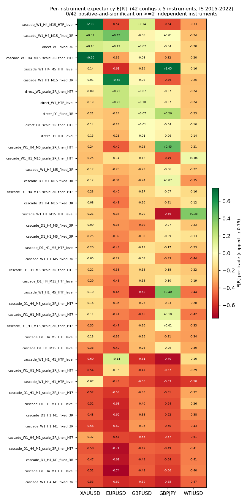

# Multi-Instrument Replication of an MTF-SMC Strategy across FX, Metals and Crude

**A pre-registered falsification study.** *In-sample 2015–2022 · XAUUSD, EURUSD, GBPUSD, GBPJPY,
WTIUSD · 42 configurations × 5 instruments = 210 trials · realistic per-instrument costs · proven
no-look-ahead.*

## Abstract

A top-down multi-timeframe Smart-Money-Concepts (SMC) price-action strategy was evaluated on a single
instrument (gold) and found to carry **no statistically confirmable edge** across a pre-registered grid
of 42 configurations. This study asks the sharper question: **does *any* configuration show an edge that
*replicates* across independent instruments after multiple-testing correction?** We re-ran the identical,
verified engine on five instruments spanning FX majors, an FX cross, a metal, and crude oil, estimating
each instrument **separately** and then testing for consistency across **independent** assets.

**Result: nothing replicates.** **0 of 42** configurations are positive-and-significant on even **one**
instrument after within-instrument BH-FDR; **0 of 42** on two or more; and **0 of 210** (config ×
instrument) cells survive the cross-instrument BH-FDR. The best correlation-aware random-effects pooled
expectancy is **−0.000 R** (one-sided p ≥ 0.50). The handful of positive point estimates are
small-sample noise that regresses to zero across assets. **A multi-asset falsification is a stronger,
more credible negative than a single-instrument one** — and that is the contribution.

---

## 1 · The replication question and the pre-registered design (set *before* the result)

The interpretation rules below were fixed **before** the multi-instrument grids were run (see
[`SPEC_multi_instrument.md`](SPEC_multi_instrument.md) §7 and
[`PROJECT_BRIEF_multi_instrument.md`](PROJECT_BRIEF_multi_instrument.md) §6):

- **"Edge" ≡ consistently positive AND individually significant across multiple *independent*
  instruments, surviving the cross-instrument correction.** A single-instrument win is **not** edge.
- A config positive on one instrument but ~0/negative elsewhere = **confirmed noise**.
- **Estimate per instrument, then assess consistency.** Never collapse correlated instruments into one
  naive N; any pooling must be correlation-aware.
- **IS/OOS gate:** all development on IS 2015–2022 (hard-sliced `< 2023-01-01`, structurally enforced).
  The out-of-sample period is touched **once, only if** a configuration survives IS replication +
  correction. **Nothing survived, so OOS was never unsealed** — no peeking, on any instrument. (XAUUSD's
  OOS had already been spent once in the prior single-instrument study; it was not revisited here.)

Stating the rules first is the point: the reader can verify the conclusion was not chosen after seeing
the numbers.

## 2 · Instruments, data, and caveats

Source: HistData.com per-year M1 `.xlsx`, fixed-EST (UTC−5, no DST) → converted to UTC, with a
**17:00 New-York-close, DST-aware** daily/weekly session anchor (the FX/metals trading-day convention;
verified to match the WTI feed's Sun-18:00→Fri-17:00 ET session — see
[`SPEC_multi_instrument.md`](SPEC_multi_instrument.md) §4). Per-instrument integrity, gaps, and a
bad-print/rollover scan are in `docs/DATA_QUALITY_<SYM>.md`. IS bar counts (2015–2022): XAUUSD 2.83M,
EURUSD/GBPUSD ~2.98M, GBPJPY 2.97M, WTIUSD 2.60M. **All five passed the integrity gate** (0 OHLC
violations, 0 NaN, 0 duplicates, monotonic).

**Caveats carried into interpretation (reported, never patched):**
- **WTIUSD 2017 is thin (83.4%)** due to a real **217-hour (9-day) source gap in Feb-2017**; it reduces
  WTI's effective early-IS sample.
- **WTIUSD April-2020** was inspected explicitly (the negative-futures event): the spot CFD floored at
  **$6.495** with **zero negative/garbage prints** — a genuine high-volatility regime, not bad data. The
  largest WTI M1 moves are all real events (Apr-2020 floor, the Mar-2020 OPEC crash, the 2019 Abqaiq
  attack).
- **New-instrument 2023 (OOS) is thin/short** (≈ 13% below a full year; WTI's 2023 ends 2023-12-01) — a
  limitation *if* OOS is ever evaluated. It was not.
- **WTI is cost-heavy for tight-stop configs:** its ~4¢ spread is a large fraction of the strategy's
  ATR-scaled stops, so WTI stop-outs cost slightly more in R than the majors' (a real cost
  characteristic, correctly modelled — §3).

## 3 · Methods and correctness — the part that separates this from a naive backtest

The engine, detectors, fill logic, and statistics are **reused unchanged and bit-identically** from the
verified single-instrument pipeline; a regression test proves the XAUUSD master table is reproduced to
the digit (identical MD5, `max |Δ| = 0` over 42 × 42 cells) after every change here. The genuinely new
correctness work was per-instrument:

**3.1 Per-instrument cost & contract calibration (the #1 correctness item).** Each instrument has its
**own** `InstrumentSpec` — tick/pip, contract size, spread, commission, swap — derived through
`money_per_price_unit = tick_value / tick_size`; **none inherit gold's numbers**. R-accounting was
hand-verified per instrument with an independent fill-based recompute (JPY-pip and per-barrel math
reconcile to the FSM's net/R).

**3.2 A real bug, caught by monitoring — not by a passing test.** The first multi-instrument grid
reported EURUSD expectancy of **≈ −25 R per trade** — an *impossible* number under correct accounting.
Because the run was observable, this surfaced in the first minute rather than hiding in a results table.
Root cause: **`stop_slippage` (0.05) and the breakeven buffer (0.02) were absolute *price* constants
calibrated for gold.** On a 5-decimal FX pair, 0.05 price = **500 pips**, so every EURUSD stop-out booked
~−50 R. The original sign-off check had missed it because it only exercised a **winning** (+3R
take-profit) trade, which never touches the stop path. *Lesson encoded:* the verification was
strengthened so every instrument now also runs a clean **−1R stop-out** and asserts `realized_R ∈
(−1.6, −1.0)` with slippage < 0.25R, plus a scale guard (slippage ≤ 5 pip, BE buffer ≤ 5 ticks). The fix
moved these into per-instrument `InstrumentSpec` fields (gold unchanged ⇒ still bit-identical).

**3.3 A systematic absolute-price-constant audit.** Because that class of bug had now appeared twice,
every numeric constant in the detection → indicator → setup → fill/FSM/cost → risk path was enumerated
and classified as **scale-invariant** (ATR/pip/tick/R-relative, a ratio, or a bar count) or
**absolute-price** (must be sourced from `InstrumentSpec`). The two offenders above were the **only**
absolute-price constants in the whole path; everything else — stops (`swing ± atr_mult·ATR`), the FVG
size filter (`× ATR`), structure breaks (close beyond a swing, no minimum-size threshold), Fib zones
(ratios), fills (pure level comparisons) — is scale-invariant by construction. The only residual
absolute numerics are `1e-9` float epsilons on *dimensionless* comparisons (negligible vs scale on every
instrument). **Verified dynamically:** the median real stop-out is **−1.14 to −1.23 R on all five
instruments**, GBPJPY and WTIUSD included.

**3.4 Cost-dependence sub-question, answered.** The single-instrument finding that "M1-LTF cascades are
killed by costs" was cost-driven, so it might not have generalized. It does: the M1-LTF cascades are
**uniformly negative on all five instruments** (e.g. `cascade_W1_H4_M1_fixed_3R` = −0.53, −0.62, −0.59,
−0.65, −0.47 R) — the deepest cascades are trade-starved and cost-bled everywhere.

## 4 · Cross-instrument dependence (mandatory before any pooling)

Daily-return correlation on common IS days (n = 2,312):

| | XAUUSD | EURUSD | GBPUSD | GBPJPY | WTIUSD |
|---|---:|---:|---:|---:|---:|
| **XAUUSD** | 1.00 | 0.37 | 0.25 | −0.15 | 0.07 |
| **EURUSD** | 0.37 | 1.00 | 0.59 | 0.18 | 0.02 |
| **GBPUSD** | 0.25 | 0.59 | 1.00 | 0.68 | 0.11 |
| **GBPJPY** | −0.15 | 0.18 | 0.68 | 1.00 | 0.20 |
| **WTIUSD** | 0.07 | 0.02 | 0.11 | 0.20 | 1.00 |

EURUSD/GBPUSD/GBPJPY share USD/GBP factors (GBPUSD–GBPJPY 0.68, EURUSD–GBPUSD 0.59); WTIUSD is nearly
independent of all; gold is moderate. The **effective number of independent instruments** (participation
ratio of the correlation eigenvalues) is **3.45 of 5** — so any pooled significance is deflated
(pooled variance ×1.45), and **five instruments are not five independent votes**.

## 5 · Results

**Within-instrument** (BH-FDR over the 42 configs, per instrument): **0/42 survive on every
instrument** — XAUUSD, EURUSD, GBPUSD, GBPJPY, WTIUSD all return 0; max DSR = 0.00 throughout. (This
alone reproduces the single-instrument null on four new assets.)

**Replication / consistency** (the evidence): per config, how many independent instruments is it
positive on, and positive-*and*-significant on?

| config | XAU | EUR | GBP | JPY | WTI | # positive | # pos & sig |
|---|---:|---:|---:|---:|---:|:--:|:--:|
| `cascade_W1_H4_M15_fixed_3R` | +0.31 | +0.42 | −0.05 | +0.01 | −0.24 | 3 | **0** |
| `direct_W1_fixed_3R` | +0.16 | +0.13 | +0.07 | −0.04 | −0.20 | 3 | **0** |
| `cascade_W1_H4_M15_HTF_level` | **+2.00** | −0.54 | +0.14 | −0.54 | −0.33 | 2 | **0** |
| `cascade_W1_H4_M5_HTF_level` | −0.14 | −0.62 | −0.19 | **+1.05** | −0.16 | 1 | **0** |

The two brightest cells do not generalize: the **+2.00 R gold** cell is positive on only **2 of 5**
instruments (the second, GBP, a marginal +0.14) and negative on the other three; the **+1.05 R GBPJPY**
cell is positive on **only itself** (1 of 5). Neither is significant on any instrument: the textbook
small-*N* mirage. No config is positive-and-significant on even one instrument, let alone two.

**Correlation-aware pooling** (DerSimonian-Laird random-effects, variance inflated ×1.45 for the
effective N) — the best six configs by pooled E[R]:

| config | k | pooled E[R] | 95% CI | one-sided p | I² |
|---|:--:|---:|---|---:|---:|
| `direct_W1_scale_2R_then_HTF` | 5 | −0.000 | [−0.27, +0.27] | 0.500 | 0 |
| `direct_W1_fixed_3R` | 5 | −0.004 | [−0.60, +0.59] | 0.506 | 0 |
| `direct_W1_HTF_level` | 5 | −0.014 | [−0.29, +0.26] | 0.540 | 0 |
| `cascade_W1_H4_M15_fixed_3R` | 5 | −0.051 | [−0.45, +0.34] | 0.599 | 0 |
| `direct_D1_fixed_3R` | 5 | −0.088 | [−0.32, +0.14] | 0.777 | 0 |
| `direct_D1_scale_2R_then_HTF` | 5 | −0.095 | [−0.20, +0.01] | 0.956 | 0 |

Every pooled estimate is ≤ 0, every CI crosses zero, and I² = 0 (no real between-instrument
signal — just noise around zero).

**Cross-(config × instrument) BH-FDR** over the full **210** trials: **0 reject** (critical p = 0).

## 6 · Conclusion

**No configuration of this MTF-SMC strategy carries an edge that replicates across independent
instruments.** The result is consistent and overdetermined: 0/42 within-instrument survivors on each of
five assets, 0/42 configs positive-and-significant on even one instrument, 0/210 cells past the cross
correction, and a best pooled expectancy of −0.000 R. The cells that look exciting in isolation (+2 R on
gold) are exactly what the design was built to *not* be fooled by — they do not repeat.

This is a **stronger** result than the single-instrument study, not a weaker one. A negative on one
market can always be dismissed as that market's idiosyncrasy or a particular regime; a negative that
**replicates as a non-result across FX majors, an FX cross, a metal, and crude — after honest
per-instrument cost modelling, a caught-and-fixed scaling bug, a full price-constant audit, and a
correlation-aware correction** — is a credible, generalizable falsification. By the pre-registered rule,
nothing earned an out-of-sample look, and the locked OOS stays sealed.

## 7 · Lineage, limitations, reproduction

**Lineage (one honest paragraph).** This project is the latest in a small arc of independent
falsification studies by the author: a subjective SMC price-action system (rejected by walk-forward
OOS) and an objective Donchian-breakout system (no confirmable edge under Monte-Carlo) both reached
negative verdicts on single instruments. Their shared lesson — that single-instrument trend/structure
alpha is too thin to confirm — is precisely what motivated this multi-instrument replication test. The
prior systems are referenced only as motivation; this study stands on its own.

**Limitations.** Modelled (not historical) spreads/slippage; one specific operationalization of SMC
discretion into rules; representative retail cost placeholders (incl. a fixed USDJPY≈120 for GBPJPY
money math, immaterial to R); WTI's thin 2017 and short 2023; deep cascades are trade-starved by
construction. **Research and educational only — not investment advice.** The strategy was found to have
no replicable edge and must not be traded.

**Reproduction.** `python scripts/ingest_instruments.py` (build per-instrument caches) →
`python scripts/run_grid.py fresh --symbol=<SYM>` for each instrument → `python scripts/run_replication.py`
(replication grid, correlation, meta-analysis, cross-correction) → `python scripts/make_replication_figure.py`.
Fixed seeds; per-instrument configs and assumptions in [`SPEC_multi_instrument.md`](SPEC_multi_instrument.md);
no licensed data committed. All detection/accounting invariants are covered by the test suite
(`python -m pytest -q`).
